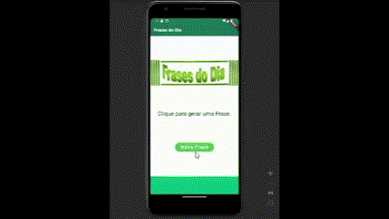

# Gerador de Frases do Dia com Flutter ✨

Este é um aplicativo desenvolvido em Flutter que gera uma frase inspiradora para o dia ao clicar em um botão. 

## Demonstração do Gerador de Frases



## Funcionalidades

- Gera uma frase inspiradora diferente a cada clique no botão.
- Interface do usuário simples e intuitiva.
- +30 frases.

## Tecnologias Utilizadas

- Flutter
- Dart

## Uso

Para utilizar este aplicativo:

1. Clone este repositório.
```bash
git clone https://github.com/italomsilva/frases_do_dia.git
```
   
2. Abra o projeto no seu ambiente de desenvolvimento Flutter.
```bash
cd frases_do_dia
flutter pub get
```

3. Execute o aplicativo em um emulador ou dispositivo físico.
```bash
flutter run
```
4. Certifique-se de ter o ambiente Flutter configurado corretamente. Para mais informações, consulte a documentação oficial do Flutter.
   
5. Licença
Este projeto está licenciado sob a Licença MIT.


## Getting Started

This project is a starting point for a Flutter application.

A few resources to get you started if this is your first Flutter project:

- [Lab: Write your first Flutter app](https://docs.flutter.dev/get-started/codelab)
- [Cookbook: Useful Flutter samples](https://docs.flutter.dev/cookbook)

For help getting started with Flutter development, view the
[online documentation](https://docs.flutter.dev/), which offers tutorials,
samples, guidance on mobile development, and a full API reference.
